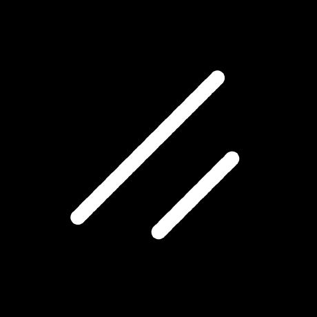

<h1 align="center">Hello There ! ... Welcome to my Profile ... </h1>

  
  
  

- 🔭 Aspiring Software Developer passionate about web, mobile, AI/ML, and Quantum Computing. Daily coder and problem solver. 
- 💻 Full-stack & Android app development with hands-on 3D modeling and graphics design.
- 🤖 Build web & mobile apps, AI/ML projects, and creative 3D/graphics solutions combining functionality and visual appeal. 
- ⚡ Agile, productive, intuitive, and innovative. Believer in learning by reading docs and building projects.

<b>Find me at ... </b>

 

  
  
  
  

<table align="center">
  <tr>
    <td align="center">
      <h3 face="Segoe UI, Tahoma, Verdana, sans-serif" size="6">
        ✨ For the best experience and to explore all my projects with detailed explanations, screenshots, and UI previews — please visit
      </h3>  
       
       
      
       
       
      <h3 face="Segoe UI, Tahoma, Verdana, sans-serif" size="6">
        ⚠️ Most of my repositories are <b>private</b> due to privacy & other reasons.
      </h3>  
    </td>
  </tr>
</table>

## 🚀 Explore My Projects here 
<table width="100%" align="center" >
  <tr width="100%">
    <td align="center" valign="top" >
      
      <h3 >ExamSphere</h3>  
       
      
      
      
      
      Marksheet Management System with dedicated Portals for teacher, student & controller with smart automation algo
       
       
      
    </td>
    <td align="center" valign="top" >
       
      <h3 size="6">EduSmart</h3>  
       
      
      
      
      
      <!--  -->
       
      Educational ERP Software for Dept, Faculty, Student, Paper and other managements
       
       
      
    </td>
    <td align="center" valign="top" >
       
      <h3 size="6">Attendance App</h3>  
       
      
      
      
      
      Android Mobile App for Attendance Management System with Photo Capture & Geofencing
       
       
      
    </td>
    
  </tr>
  <tr>
  <td align="center" valign="top" >
      
       
      <h3 size="6">Barcode POS App</h3>  
      
      
      
      
      Android Mobile App for Attendance Management System with Photo Capture & Geofencing
       
       
      
    </td>
  <td align="center" valign="top" >
  
       
      <h3 size="6">Barcode POS App</h3>  
      
      
      
      
      Android Mobile App for Attendance Management System with Photo Capture & Geofencing
       
       
      
  </td>
  <td align="center" valign="top" >
  
       
      <h3 size="6">Barcode POS App</h3>  
      
      
      
      
      Android Mobile App for Attendance Management System with Photo Capture & Geofencing
       
       
      
  </td>
  </tr>
  <tr>
  <td colspan="3" align="center" valign="center" >
    <h3 size="6">Explore All Projects ... </h3>  
    
  </td>
  </tr>
</table>

<table>
  <tr>
    <th>💼 Category</th>
    <th>🚀 Tools & Languages</th>
  </tr>

  <tr>
    <td><b>Programming Languages</b></td>
    <td>
      
    </td>
  </tr>

  <tr>
    <td><b>Frontend 🎨💻🖌️</b></td>
    <td>
      
    </td>
  </tr>

  <tr>
    <td><b>Backend 🖥️🔧⚙️</b></td>
    <td>
      
    </td>
  </tr>

  <tr>
    <td><b>Database 🗄️💾📊</b></td>
    <td>
      
    </td>
  </tr>

  <tr>
    <td><b>AI / ML 🤖📈</b></td>
    <td>
      
    </td>
  </tr>

  <tr>
    <td><b>3D & Design 🍩🎨</b></td>
    <td>
      
    </td>
  </tr>

  <tr>
    <td><b>Operating System</b></td>
    <td>
      
    </td>
  </tr>

  <tr>
    <td><b>Other Tools</b></td>
    <td>
      
    </td>
  </tr>
</table>

<!--
# 📊GitHub Stats :
<table align="center">
<tr>
<td>
</td>
<td>

 

</td>
</tr>
</table>
-->
