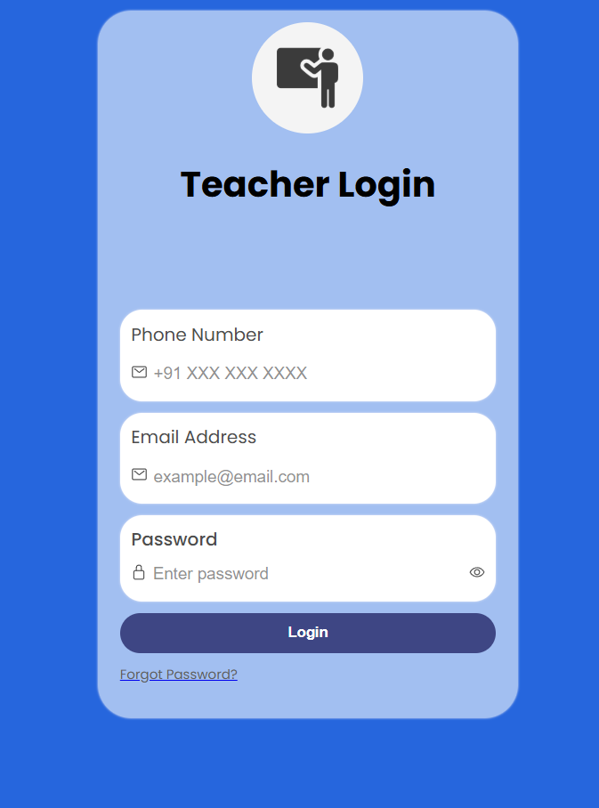

# 📝 ExamSphere - Marksheet Management System

A comprehensive monolithic PHP system for managing exams, marksheets, and student results.
Supports Admin, Teacher, and Student portals with full CRUD operations and streamlined workflows.

---

### Admin Portal Features
* ✅ Manage Papers, Streams, Exams, Students, Teachers, and Marksheets
* 🔓 Open/Close Enrolment
* 🎯 Assign Head Examiners
* 📝 Distribute Papers
* 🔒 Lock/Unlock Marks Upload
* 📤 Publish Marksheets

### Student Portal Features 
* 🧑‍🎓 Register & Login
* 📝 Update Profile
* 📋 Enrol/Cancel Exam
* 🏆 Check Results

### Teacher Portal Features
* 🔑 Login
* 📝 Update Profile
* 📤 Upload Marks  

---

## 📊 Exam Schema

1. **Create Papers**
2. **Create Streams** → Add papers to streams
3. **Create Examinations** → Add streams to exams

---

## 💻 Project Structure (Concise)

```
/exam-sphere/web
├─ index.php ( home page )
├─ /admin ( admin pages )
├─ /teacher ( teacher pages )
├─ /candidate ( candidates pages )
├─ /assets ( project assets )
├─ /include (connect.php, header.php)
├─ /phpqrcode ( qr code generator )
├─ /profile_img ( profile images )
|   ├─ /admin
|   ├─ /student
|   ├─ /teacher
├─ /qr_codes ( storing qr codes )
└─ /side nav ( sidenav codes )
```

---

## 🌟 Screenshots




---

## 📌 License

MIT License © 2025
